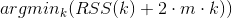

# AIC and BIC

## Definition
The **Akaike Information Criterion (AIC, Akaike is the name of its author)** and the **Bayesian Information Criterion (BIC)**, also called Schwartze (the name of its author) Criterion were defined in the seventies.
Based on the likelihood, they both define a way to penalize the model complexity [1][2].

If we consider that K-means returns clusters that are Gaussians with identical spherical covariance matrices and uniform cluster priors, we can write AIC and BIC according to the RSS (inertia), with L(k)=-1/2 RSS(k) according to [3].

**BIC :** 

**AIC :** 

## References
[1] Schwarz, G. (1978). Estimating the dimension of a model. *The annals of statistics*, 6(2), 461-464.

[2] Akaike, H. (1974). A new look at the statistical identification model. *IEEE Trans. Auto. Control*, 19, 716-723.

[3] Christopher D. Manning, Prabhakar Raghavan and Hinrich Schütze, *Introduction to Information Retrieval*, Cambridge University Press. 2008. 
