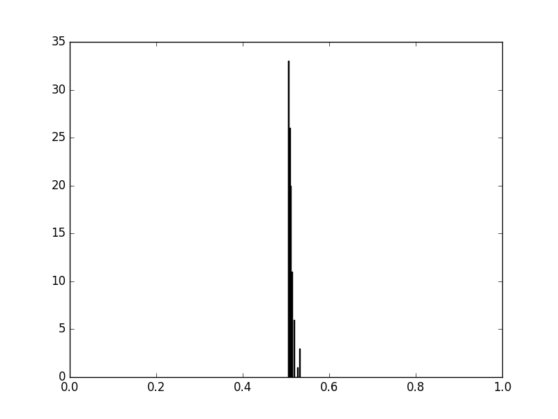
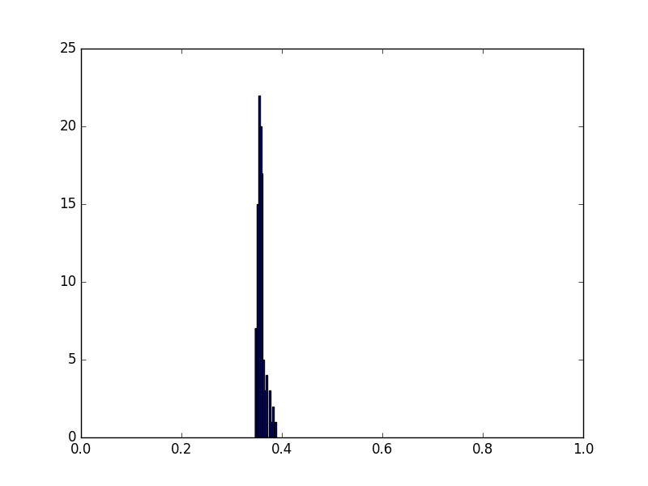
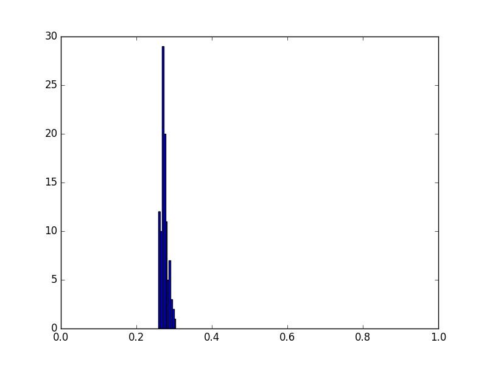
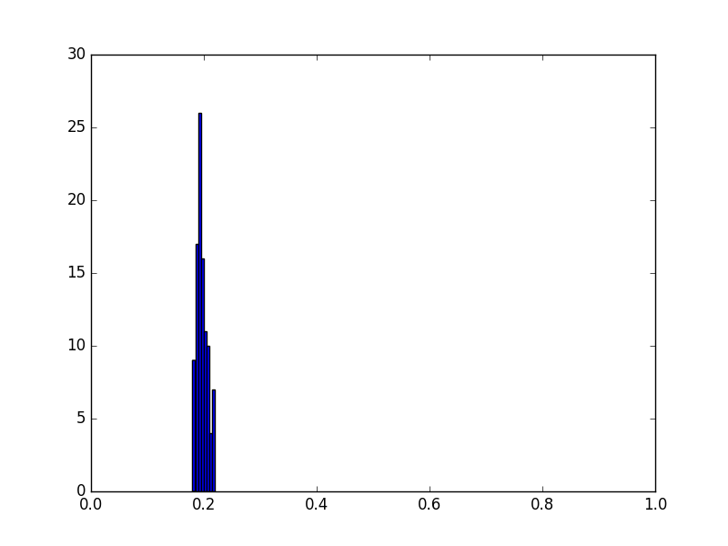
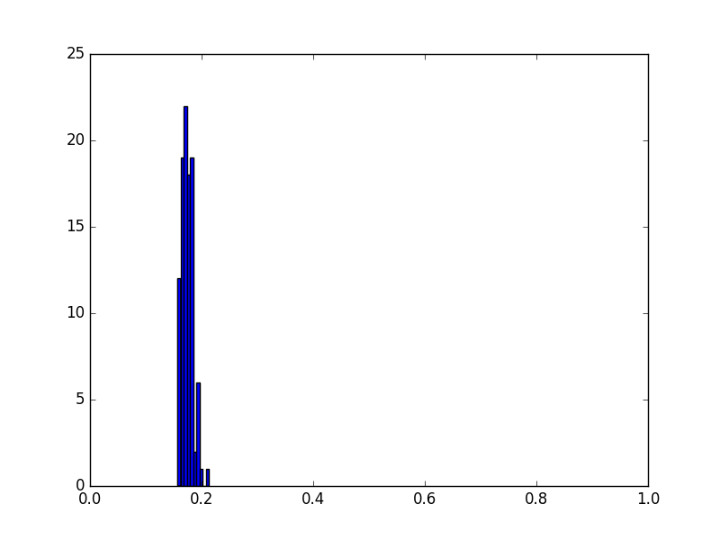

# Subsampling approach

## About

This method to find the correct number of clusters is a stability based one [1].
Basically, the idea is that a clustering algorithm should return a partition describing the latent structure of the data. Thus, if some data are missing, i.e., if one considers a sample of this data, this structure should be the same.

Based on this idee, the algorithm is basically as follows :
for each k,
- one runs a large number of times a clustering algorithm on different subsamples of the data ;
- one considers the agreement between the results.

To consider the agreement, the authors propose several measures, and use the correlation.

Then, by looking at the correlation distribution, one may be able to find the correct k.

Our experiments using K-means show that it seems not to work for our data, and with such a clustering algorithm. Indeed, the partitions returned by K-means seems to bee too suboptimal.
The agreement between the partitions returned slowly and monotonically decreases with the increase of k.

One can find the code in *quality_sampling.py* and results on our data in *results*.

## Exemple with IRIS Data
### K = 2

### K = 3

### K = 4

### K = 5

### K = 6

## References

[1] Ben-Hur, A., Elisseeff, A., & Guyon, I. (2001). A stability based method for discovering structure in clustered data. In Pacific symposium on biocomputing (Vol. 7, pp. 6-17).
